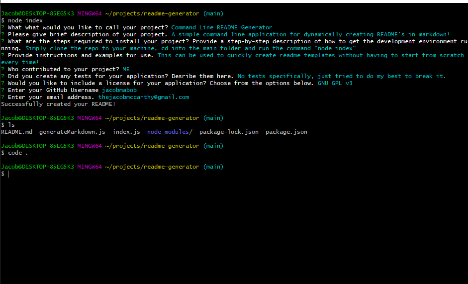

  # README Generator

  ## Table of Contents
  
  - [Description](#description)
  - [Installation](#installation)
  - [Usage](#usage)
  - [Tests](#tests)
  - [Questions](#questions)

  ---

  ## Description

  README Generator is a simple command line application for dynamically creating README's in markdown. It is my first application created with node.js and uses the FS and Inquirer packages. Through a series of command line prompts, users are able to generate a template for their README, saving time and headache. 

  ---

  ## Installation

  Simply clone the repo to your machine and you're good to go. 

  ---

  ## Usage

  This can be used to quickly create readme templates without having to start from scratch every time!  
  The template includes sections for:  

  - Title of your project
  - Table of contents
  - Description 
  - Usage
  - Contributions
  - Tests
  - License, if you choose to use one
  - Contact section containing a link to your github and email 

  After running the command "node index" in your terminal, the program will give you a series of prompts. When you've answered all of the prompts, it will generate a filled out README template for your project.  

  
   
  [Walk-Through Video](https://watch.screencastify.com/v/OiOAM8EMM4nbOdmvWQiw)
  ---

  ## Tests

  No tests specifically, just tried to do my best to break it.

  ---

  ## Questions
  Have any questions? Feel free to check out my github or send me an Email!

  github.com/jacobmabob  
  thejacobmccarthy@gmail.com

